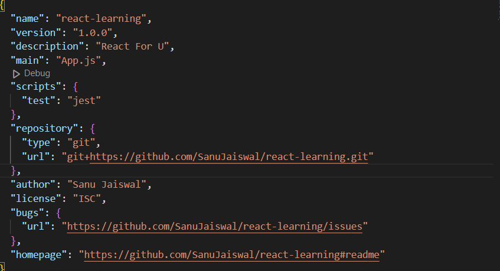

# Here Is React For U

**_npm(Manage packages)_** - Standard repo for all the packages.<br />
**_bundler_(webpack, vite, parcel)** - bundles the app to be shipped to prod<br />
**_package.json_** - configuration for npm<br />
**_package-lock.json_** - track the excat version of all the transitive dependencies our project needs<br />
**node_modules** - contains the code of all the dependencies installed<br />
**_npx_** - Executing the bundler<br />
**_Babel_** - Transpiles JSX to React.createElement(JS Engine understandable language)<br />

1. npm init
   -> creates **package.json**
   

2. npm install -D parcel
   -> dependency added in package.json +
   creates **package-lock.json** +
   creates **node_modules**<br />
   npm install -> creates **node_modules** if not there

3. npm install react

4. npm install react-dom

5. npx parcel index.html
   -> parcel has hosted our app in server, like : http://localhost:1234<br />
   For prod - npx parcel build index.html and delete main in package.json<br />
   -> Add the command in scripts in package.json using
   **npm run start** OR **npm start** for dev
   **npm run build** for prod

# React Element without and with jsx -->

```
    const heading = React.createElement(
    "div",
    { id: "parent" },
    React.createElement("div", { id: "child" }, [
        React.createElement("h1", {}, "I am h1"),
        React.createElement("h2", {}, "I am h2"),
    ])
    );
    const root = ReactDOM.createRoot(document.querySelector("#root"));
    root.render(heading);
```

```
    const jsxHeading = <h1>React is here</h1>;
    console.log(jsxHeading);
    const root = ReactDOM.createRoot(document.getElementById("root"));
    root.render(jsxHeading);
```
